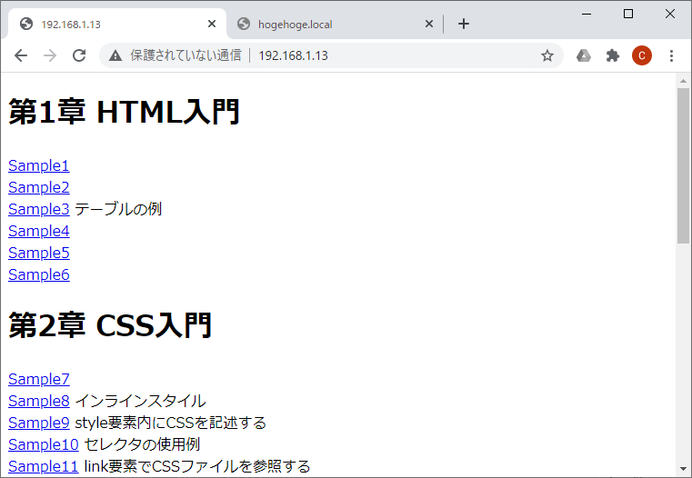
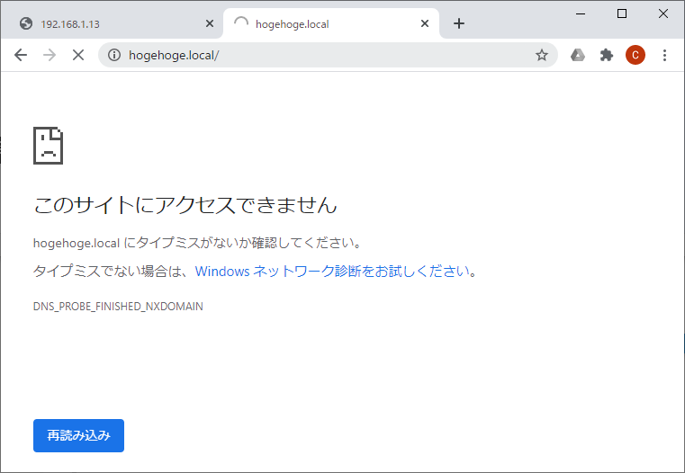
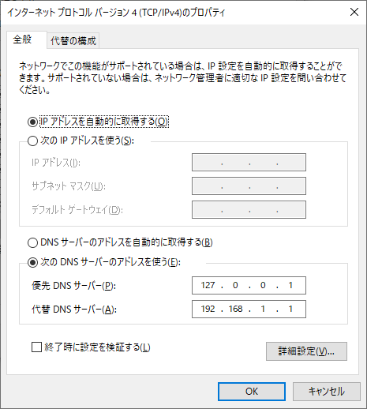
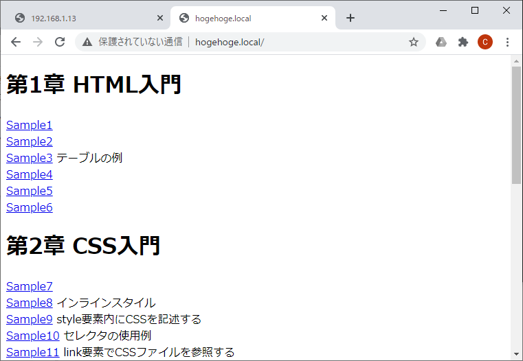

# Create_DNS_Server_Container
DNSサーバをDockerコンテナとして作成する。

- [Create_DNS_Server_Container](#create_dns_server_container)
  - [コマンド](#コマンド)
    - [コンテナ起動](#コンテナ起動)
  - [設定例](#設定例)
    - [設定前](#設定前)
    - [DNS構築](#dns構築)
    - [DNS設定](#dns設定)
      - [Windows10の場合](#windows10の場合)
    - [設定確認](#設定確認)
  - [参考](#参考)

## コマンド

### コンテナ起動

```
docker-compose up -d
```

## 設定例

hogehoge.localを192.168.1.13と紐づける。

### 設定前





### DNS構築

extra_hostsにホスト名とIPを記載する。
```docker-compose.yml
dnsmasq:
  restart: always
  image: andyshinn/dnsmasq
  container_name: dnsmasq
  ports:
    - "53:53/udp"
    - "53:53/tcp"
  extra_hosts:  
    - "hogehoge.local:192.168.1.13"
  cap_add:
    - NET_ADMIN
```

起動。
```
docker-compose up -d
```

### DNS設定

作成したDNSサーバを参照するように設定する。

#### Windows10の場合

この設定画面を開く。



ローカルにDNSサーバを立てているので、下記設定。
- 優先DNSサーバー：127.0.0.1

※代替DNSサーバーはサーバー構築とは無関係なので無くても設定できるが、これがないとインターネットにつながらないので設定しておく。  
※代替DNSサーバーに127.0.0.1を設定しても効果がない。優先でないとダメ。

一応画面の起動手順記載。
1. スタート
2. 設定
3. ネットワークとインターネット
4. Wi-Fi（有線の場合は違うかも…）
5. 関連設定 - アダプターのオプションを変更する
6. 接続しているWi-Fiを右クリック
7. プロパティを押下
8. インターネット プロトコル バージョン 4(TCP/IPv4)
9. プロパティを押下

### 設定確認

IPと同じ画面が出ることを確認。


## 参考

- [DockerでDnsmasqを使った内部DNSサーバを構築するメモ](https://7me.nobiki.com/2020/04/22/dnsmasq-docker-memo/)
  - 何だこれ。ちょう簡単じゃん・・・
- [闘うITエンジニアの覚え書き:cURLメモ](https://www.magata.net/memo/index.php?cURL%A5%E1%A5%E2#x66a3dc9)
  - curlでDNSサーバを指定する方法
- [it-swarm-ja.tech:dnsオプションを使用してCURLを実行する際の問題](https://www.it-swarm-ja.tech/ja/networking/dns%E3%82%AA%E3%83%97%E3%82%B7%E3%83%A7%E3%83%B3%E3%82%92%E4%BD%BF%E7%94%A8%E3%81%97%E3%81%A6curl%E3%82%92%E5%AE%9F%E8%A1%8C%E3%81%99%E3%82%8B%E9%9A%9B%E3%81%AE%E5%95%8F%E9%A1%8C/997990830/)
  - curlのオプションが効かない
